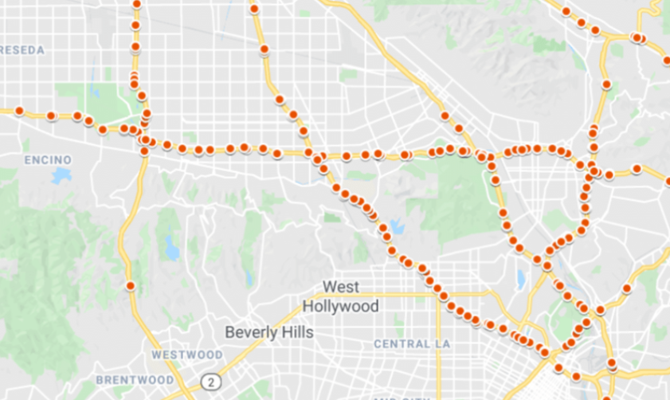
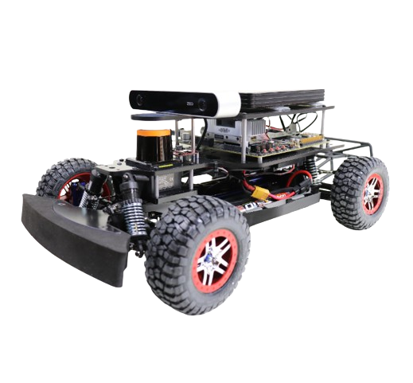
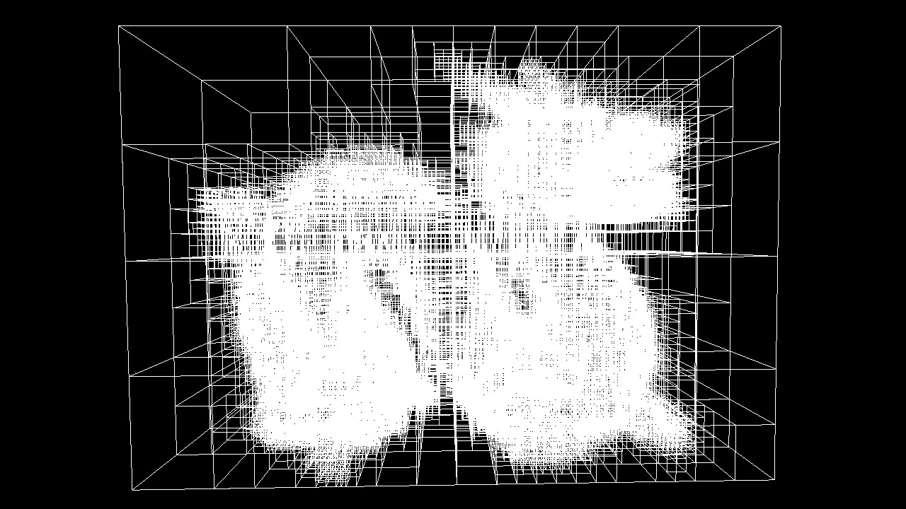
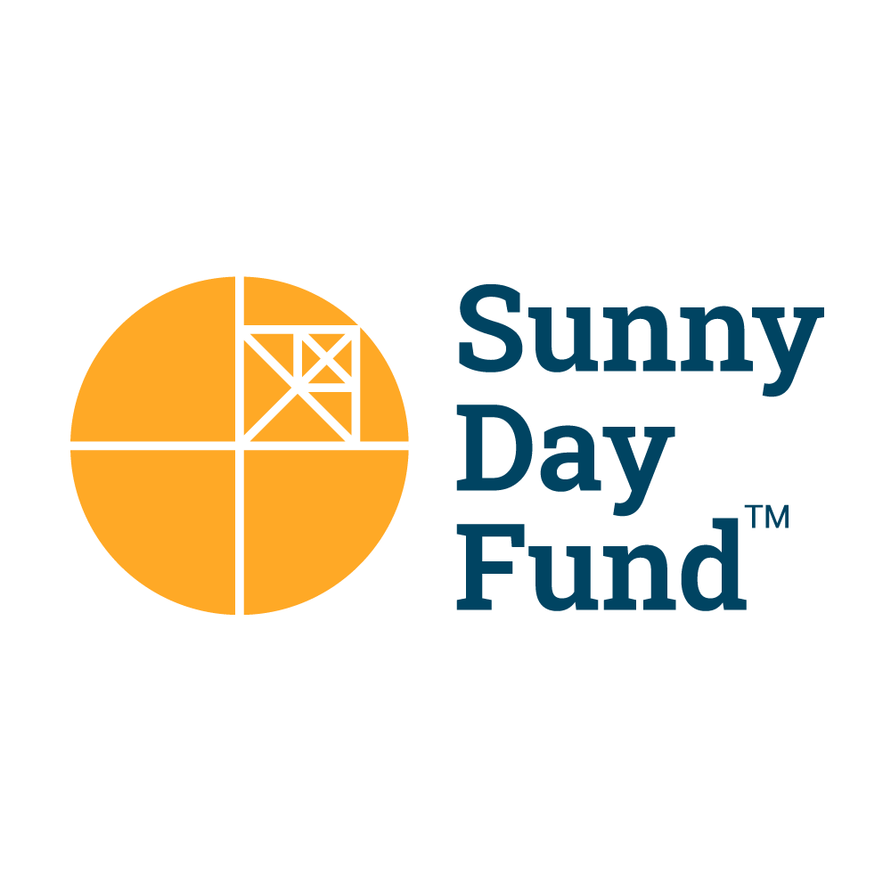

Hi! My name is Navpreet Singh and I am a third-year undergraduate at MIT studying Artificial Intelligence and Decision Making. 

My journey so far has been a thrilling blend of exploring Natural Language Processing at MIT's CSAIL, and delving into the field of Robotics through both my academic coursework and a hands-on internship at Lockheed Martin. As a developer, I've gained practical experience with full-stack development and automation during my internships at HelixVM and Sunny Day Fund. Finally, as an educator, I have taught Computer Science and AI courses in Jerusalem and Amman, while continuing my role as an Executive Director and Co-Founder of Future for Young Scientists.

These experiences have not only honed my skills but also fueled my passion for AI, Computer Science, and its potential to revolutionize the way we interact with technology.

## Projects 
---

### [Analyzing the Impact of Temporal Data Sparsity on Predictive Accuracy: a Study of Spatio-Temporal Graph Convolutional Networks for Traffic Pattern Modeling](./projects/stgcn_exploration_project/stgcn_exploration_project)

*final project for mit course 6.s898 deep learning*

This project investigates the impact of sparse temporal data on the predictive accuracy of Spatio-Temporal Graph Convolutional Networks (ST-GCNs) in traffic modeling, addressing a gap in understanding these models' performance under real-world data irregularities.

---

### [Autonomous Racing Robot: Leveraging LiDAR and Computer Vision for Dynamic Path-Planning and Real-Time Obstacle Navigation in Competitive Environments](./projects/rss/rss)

*semester project for mit course 6.4200 robotics science and systems*

This project encompassed the development of an autonomous race car capable of navigation using LiDAR and computer vision. On a team of five, we implemented techniques such as wall following, Monte Carlo Localization, and path planning, culminating in successful navigation of track races and obstacle courses.

---

### [Exploring Accelerated KD-Tree Construction Techniques for Efficient Ray Tracing](./projects/kdtree/kdtree)

*final project for mit course 6.4400 computer graphics*

This project investigates advanced KD-tree construction techniques to enhance ray tracing efficiency, focusing on dynamic scenes where traditional methods are computationally intensive. It implements and analyzes the performance of O(N log N) and O(N log^2 N) SAH-based algorithms.

---

### <a href="https://futureforyoungscientists.org/" target="_blank">Future for Young Scientists</a>

*educational organization offering free STEM courses to students in grades 2-7; website implemented with reactJS*

We founded FYS with the mission to inspire children to think critically, like scientists. We believe that fostering scientific curiosity at a young age is essential to get our students on a path to learn about the STEM field. Through the engaging nature of hands-on learning, lessons become more appealing and fun while bringing out the inner curiosity that is present in every child.

<!-- 
<a href="#"><i>back to top</i></a>
>
  -->
[*back to top*](#)

---

## Work Experience

### <a href="https://www.csail.mit.edu/research/decentralized-information-group-dig" target="_blank">Natural Language Processing Researcher</a>

**MIT Computer Science and AI Laboratory; Decentralized Information Group**

*cambridge, ma; february 2023 - present*

Contributing to <a href="https://www.csail.mit.edu/research/privacyml-privacy-preserving-framework-machine-learning" target="_blank">**PrivacyML**</a> with a context-aware Named-Entity Recognition (NER) framework. Utilized **SpaCy**, **PyTorch** and **Pandas** to extract metadata from unstructured text, enhancing exposure metrics for a synthetic dataset generation pipeline employing **Generative Adversarial Network** (GAN) technology. *(paper to be published soon)*

Conducting research in Natural Language Processing (NLP), focusing on the evaluation of Large Language Models (LLMs) for diverse use cases and the design of a comprehensive framework to assess model **performance**, **privacy**, and **bias**.

Currently developing a suite of metrics, including **perplexity**, **BLEU score**, **METEOR score**, and **context-aware exposure**, to measure the quality and contextual appropriateness of LLM-generated text and translations. Benchmark datasets will cover a wide range of language understanding and generation tasks, ensuring consistent evaluation of LLMs' performance.

---

### <a href="https://helixvm.com/" target="_blank">Software Engineer Intern</a>

**HelixVM**

*remote; january 2024 - present*

Collaborated closely with software engineering and cloud platform teams to develop **automation bots**, resulting in streamlined and automated business processes, leading to increased efficiency and reduced manual workload.

Designed, implemented, and integrated end-to-end **RPA solutions** for various business processes, leveraging **data science** skills and a proficiency in Python, Java, **NodeJS**, **React**, **JavaScript**, HTML, CSS, and Amazon AWS, contributing to improved productivity and quality within HelixVM's healthcare marketplace.

---

### <a href="https://www.lockheedmartin.com/en-us/products/sikorsky-black-hawk-helicopter.html" target="_blank">AI/ML Engineering Intern</a>

**Lockheed Martin - Sikorsky Aircraft**

*stratford, ct; may 2023 - august 2023*

Engineered and deployed real-time **LiDAR** data processing frameworks, leveraging **Potree** to efficiently organize and process 500,000-1,000,000 data points per second into a hierarchical octree structure. Explored **PointNet** and other deep learning models to extract crucial features from the LiDAR point cloud data.

Developed a LiDAR raycasting simulator in **C++** within **osgEarth**, enabling rapid analysis of various terrains and providing 4000 vertical and horizontal clearances per second at any specified 3-dimensional coordinates.

Designed and implemented a mission debugger using **OpenGL** and **Dear ImGui**, offering real-time visualization of simulated aircraft mission stacks, enhancing debugging capabilities and overall project efficiency.

---

### <a href="https://www.media.mit.edu/groups/city-science/overview/" target="_blank">Undergraduate Researcher</a>

**MIT Media Lab; City Science Group**

*cambridge, ma; february 2023 - august 2023*

Contributed to <a href="https://www.media.mit.edu/projects/axol/overview/" target="_blank">**Axol**</a>, a distributed sensing system for managing water resources in informal communities. The <a href="https://www.nature.com/articles/s41598-023-46236-3#Sec13" target="_blank">project paper</a> was published as Sensor platform for assessment of water usage patterns in informal settlements in **Scientific Reports**, a **Nature** publication.

Developed a user-friendly application using **OpenCV** and Meta AI's **Segment Anything Model** (SAM) to provide real-time water tank volume estimation within 5% accuracy. Successfully integrated image processing capabilities to deliver precise results, enhancing the user experience.

---

### <a href="https://sunnydayfund.com/" target="_blank">Software Engineer Intern</a>

**Sunny Day Fund**

*arlington, va; may 2022 - july 2022*

Contributed to fullstack development of the company website using **Angular** to increase sales leads, widen the company’s exposure, and allow the company to post updates about their mission to secure further funding. 

Improved UX of company’s POS software using **Angular**, NodeJS, HTML, leveraging APIs such as **HubSpot** & **Amazon AWS**.

Rewrote documentation to streamline technical onboarding for new hires, reducing the duration of the training period.

---

### <a href="https://misti.mit.edu/your-resources/crafting-your-experience/types-programs/global-teaching-labs" target="_blank">Artificial Intelligence Educator</a>

**MIT Global Teaching Labs - Arab World**

*amman, jordan; december 2022 - february 2023*

Developed and delivered a comprehensive AI curriculum to 150+ students at prestigious institutions, covering topics like models of **inference**, **PyTorch**, **Deep Learning** with Neural Networks, and **Natural Language Processing**.

---

### <a href="https://www.meet.org/" target="_blank">Computer Science Instructor</a>

**Middle East Entrepreneurs of Tomorrow**

*jerusalem, israel; july 2022 - august 2022*

Developed 4-week **Python**-based Computer Science curriculum to introduce programming concepts to high school freshmen.

Worked with 120 Israeli and Palestinian students to spark binational conversations and forge bonds that create a cooperative, productive culture through a shared love for computer science.

[*back to top*](#)

---

## Coursework

<a href="https://phillipi.github.io/6.s898/" target="_blank">**deep learning** *6.s898*</a> - a graduate course exploring various deep learning architectures, such as transformers, graph neural networks, recurrent neural networks, and generative AI

**representation, inference, and reasoning in AI** *6.141* - a graduate course exploring Markov decision processes, recurrent neural networks, graph search algorithms, and planning

**computer graphics** *6.4400* - a course exploring ray tracing, image processing, animation, and simulation, with a focus on implementation

**robotics: science and systems** *6.4200* - a course with a semester long [autonomous racing robot](./projects/rss/rss) project, implementing various robotics algorithms such as A\*, RRT, and RRT\* and techniques such as Monte Carlo localization

**machine learning** *6.3900* - an introductory course exploring regression, fully-connected neural networks, convolutional neural networks, and reinforcement learning, with weekly labs exploring theory and implementation

**inference** *6.3800* - a course exploring various inference techniques, such as Bayesian frameworks and Hidden Markov Models, with a focus on theoretical exploration and real world data science applications

**algorithms** *6.1210* - a course exploring data structures, sorting algorithms, graph search algorithms, and encryption

**fundamentals of programming** *6.1010* - a Python-based programming course exploring concepts such as graph search, recursion, backtracking, interpreters, and image processing

**data science** *6.100b* - a programming course exploring concepts such as regression, clustering, and Monte Carlo methods

**linear algebra and optimization** *18.c06* - a linear algebra course focusing on advanced optimization concepts, modeling, and applications; labwork was completed in [***Julia***](https://julialang.org/)

[*back to top*](#)

