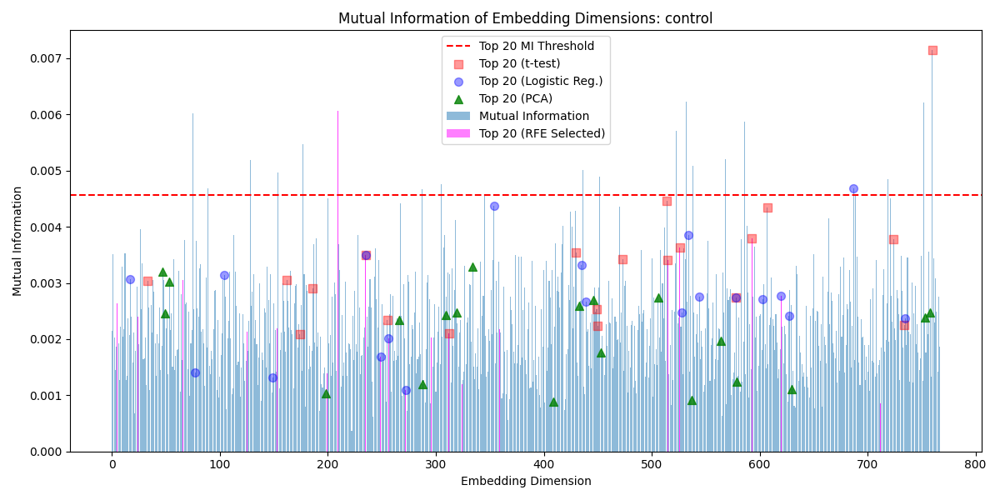
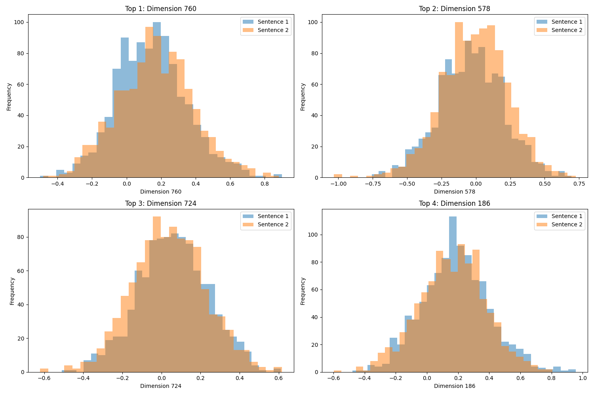

# Data for All Linguistic Properties

[Control](#control), [Definiteness](#definiteness), [Factuality](#factuality), [Intensifier](#intensifier), [Negation](#negation), [Polarity](#polarity), [Quantity](#quantity), [Subject-Object](#subject-object), [Synonym](#synonym), [Tense](#tense), [Voice](#voice)

- [Control](#control), 
- [Definiteness](#definiteness), 
- [Factuality](#factuality),
- [Intensifier](#intensifier), 
- [Negation](#negation), 
- [Polarity](#polarity), 
- [Quantity](#quantity), 
- [Subject-Object](#subject-object), 
- [Synonym](#synonym), 
- [Tense](#tense), 
- [Voice](#voice)

# Control

The control group contains sentence pairs of completely unrelated sentences. This is used to compare to the LDSPs.

## Mutual Information Values with Analysis Overlays

## Top T-Test P-Values 

## Top EDI Scores

| Dimension | EDI Score           |
|-----------|---------------------|
| 578       | 0.669590871524467   |
| 209       | 0.6668013890917615  |
| 760       | 0.6579468232819122  |
| 235       | 0.621041874367251   |
| 430       | 0.6101312797583489  |
| 154       | 0.6061788758782769  |
| 593       | 0.6031016549960083  |
| 752       | 0.5992313250852943  |
| 526       | 0.5855492430959737  |
| 724       | 0.5825517264825121  |
| 327       | 0.5814285598795159  |
| 534       | 0.575437295128086   |
| 354       | 0.5679087113239911  |
| 186       | 0.5641980835563231  |
| 515       | 0.5613010937751449  |
| 435       | 0.5565589476722599  |
| 586       | 0.5558196507439086  |
| 514       | 0.5483990260237208  |
| 256       | 0.5308161230704013  |
| 162       | 0.5293937625266878  |

# Definiteness

Filler

# Factuality

Filler

# Intensifier

Filler

# Negation

Filler

# Polarity

Filler

# Quantity

Filler

# Subject-Object

Filler

# Synonym

Filler

# Tense

Filler

# Voice

Filler

