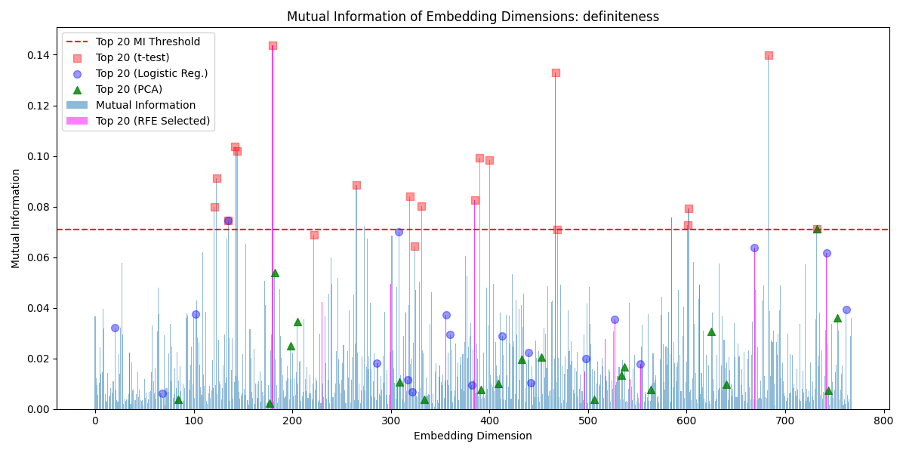
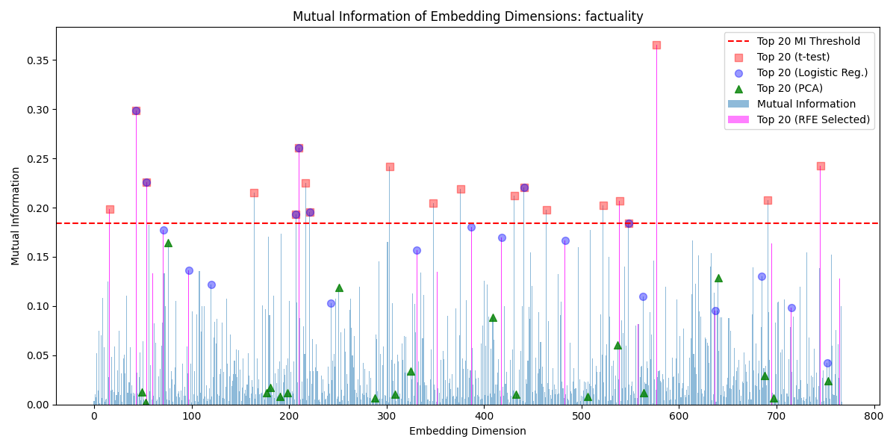
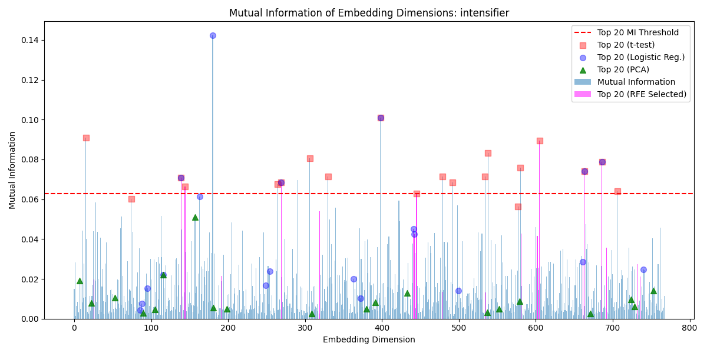
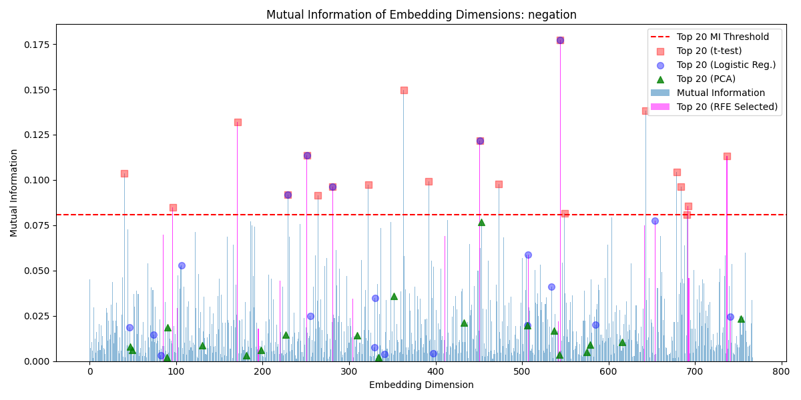
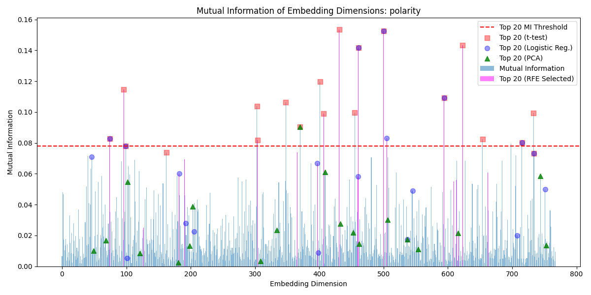
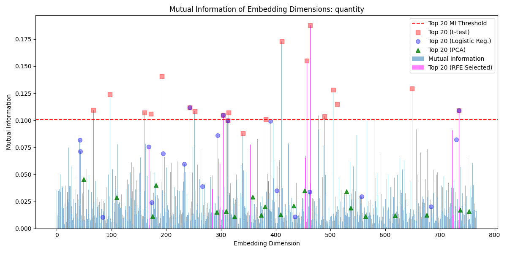
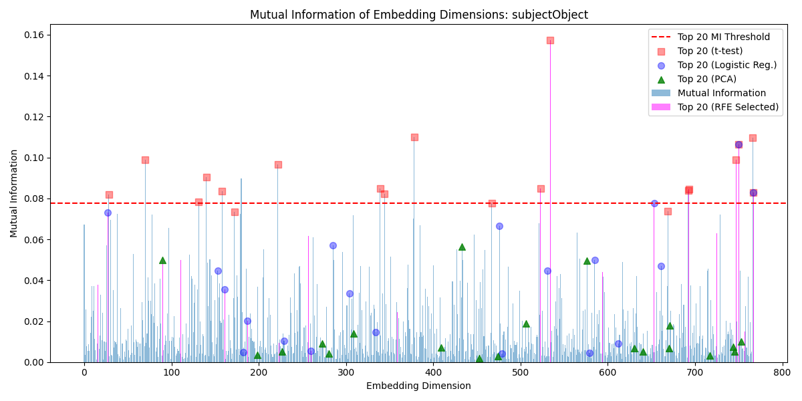
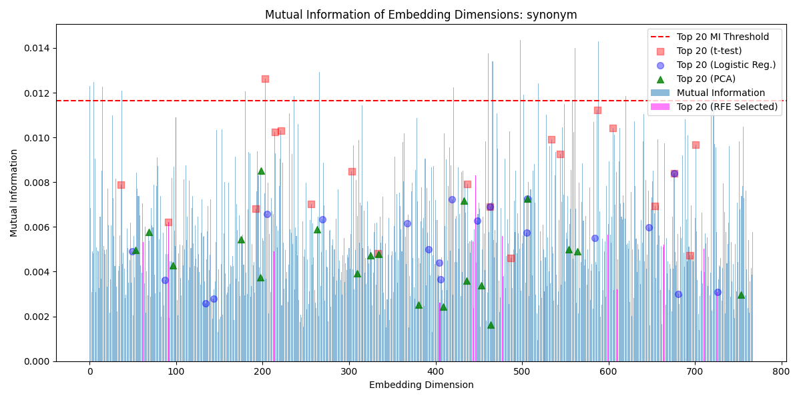
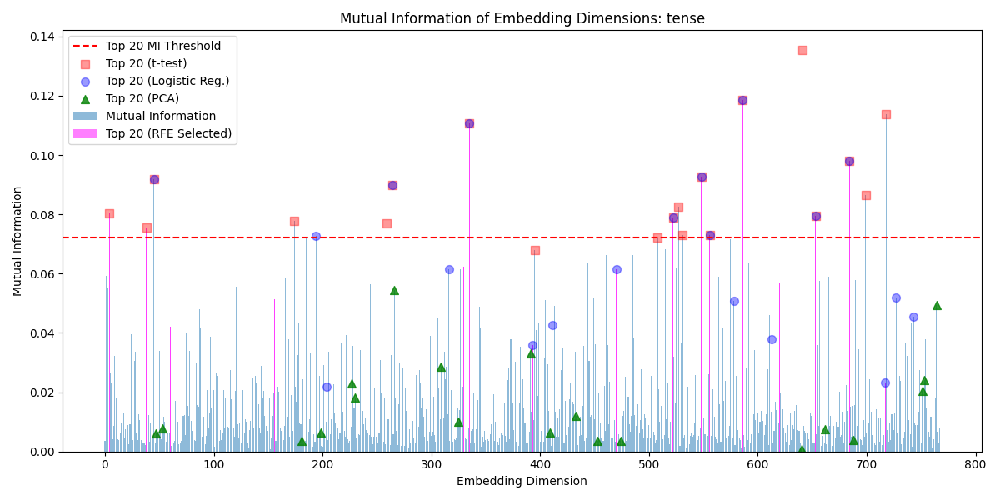
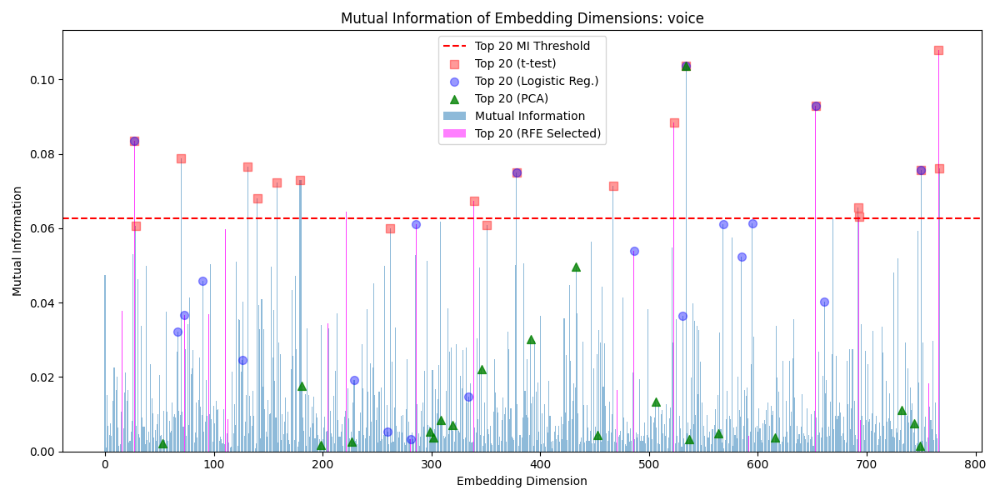

# Data for All Linguistic Properties

# Table of Contents
- [Control](#control)
- [Definiteness](#definiteness)
- [Factuality](#factuality)
- [Intensifier](#intensifier)
- [Negation](#negation)
- [Polarity](#polarity)
- [Quantity](#quantity)
- [Subject-Object](#subject-object)
- [Synonym](#synonym)
- [Tense](#tense)
- [Voice](#voice)

# Control

The control group contains sentence pairs of completely unrelated sentences. This is used to compare to the LDSPs.

_Example_
- The chef did not create a culinary delight.
- He worked incredibly long hours this week.

## Mutual Information Values with Analysis Overlays

## Top T-Test P-Values 

## Bottom T-Test P-Values 

## Top EDI Scores

| Dimension | EDI Score           |
|-----------|---------------------|
| 578       | 0.669590871524467   |
| 209       | 0.6668013890917615  |
| 760       | 0.6579468232819122  |
| 235       | 0.621041874367251   |
| 430       | 0.6101312797583489  |
| 154       | 0.6061788758782769  |
| 593       | 0.6031016549960083  |
| 752       | 0.5992313250852943  |
| 526       | 0.5855492430959737  |
| 724       | 0.5825517264825121  |
| 327       | 0.5814285598795159  |
| 534       | 0.575437295128086   |
| 354       | 0.5679087113239911  |
| 186       | 0.5641980835563231  |
| 515       | 0.5613010937751449  |
| 435       | 0.5565589476722599  |
| 586       | 0.5558196507439086  |
| 514       | 0.5483990260237208  |
| 256       | 0.5308161230704013  |
| 162       | 0.5293937625266878  |

[Back to Top](#table-of-contents)

# Definiteness

_Definiteness_ involves the use of definite or indefinite articles within a sentence, such as _the_ compared to  _a_, respectively.

_Example_
- The mountain is high
- A mountain is high

## Mutual Information Values with Analysis Overlays

## Top T-Test P-Values 

## Bottom T-Test P-Values 

## Top EDI Scores

| Dimension | EDI Score           |
|-----------|---------------------|
| 180       | 0.9454636354217103  |
| 467       | 0.7581905229230392  |
| 683       | 0.7529040174599317  |
| 308       | 0.7100225617296227  |
| 135       | 0.6451089453223289  |
| 123       | 0.6393451753137962  |
| 300       | 0.629859584045246   |
| 390       | 0.624469491707671   |
| 669       | 0.6137788799675302  |
| 432       | 0.6115880005127322  |
| 585       | 0.6086791052109894  |
| 319       | 0.6062382288945479  |
| 385       | 0.6016867547336125  |
| 602       | 0.5973500290486002  |
| 430       | 0.5930620497807265  |
| 144       | 0.5895631098599319  |
| 400       | 0.5832063419118184  |
| 670       | 0.5777779596343393  |
| 527       | 0.5777424734441166  |
| 301       | 0.5733877849782353  |

[Back to Top](#table-of-contents)

# Factuality

_Factu involves the use of definite or indefinite articles within a sentence, such as _the_ compared to  _a_, respectively.

_Factuality_ refers to the degree of truth implied by the structure of the sentence.

_Example_
- He finished the project.
- He might have finished the project.

## Mutual Information Values with Analysis Overlays

## Top T-Test P-Values 

## Bottom T-Test P-Values 

## Top EDI Scores

| Dimension | EDI Score           |
|-----------|---------------------|
| 577       | 0.8906306414092852  |
| 210       | 0.7954753367258884  |
| 43        | 0.7441569793641776  |
| 387       | 0.7427170447134487  |
| 539       | 0.707962174818101   |
| 60        | 0.7011232132851689  |
| 745       | 0.6903979628616708  |
| 54        | 0.6700446861091855  |
| 483       | 0.669069651905041   |
| 441       | 0.6602889363610431  |
| 16        | 0.6577130235680653  |
| 731       | 0.6576874270500992  |
| 303       | 0.6570978024458025  |
| 217       | 0.6524345894602406  |
| 418       | 0.6477525916018537  |
| 522       | 0.6450700119216614  |
| 756       | 0.6368032938286775  |
| 431       | 0.6361311107289214  |
| 548       | 0.6293806154744584  |
| 221       | 0.6234708654637895  |

[Back to Top](#table-of-contents)

# Intensifier

_Intensifier_ refers to the degree of emphasis present within a sentence. 

_Example_
- The temperature is comfortable.
- The temperature is very comfortable.

## Mutual Information Values with Analysis Overlays

## Top T-Test P-Values 

## Bottom T-Test P-Values 

## Top EDI Scores

| Dimension | EDI Score           |
|-----------|---------------------|
| 605       | 0.7484594299423794  |
| 445       | 0.7483709478361277  |
| 398       | 0.7298854257609706  |
| 180       | 0.7215437487289713  |
| 663       | 0.7084642535292113  |
| 291       | 0.705819904623296   |
| 306       | 0.6668171227059465  |
| 581       | 0.6617462340206344  |
| 441       | 0.6514209352660703  |
| 269       | 0.6511074837866452  |
| 15        | 0.6476573742532392  |
| 740       | 0.6420914055300422  |
| 144       | 0.6420480749938454  |
| 686       | 0.641693358221895   |
| 264       | 0.6408655561976887  |
| 139       | 0.6366687650633885  |
| 661       | 0.6346565338894279  |
| 498       | 0.6331379839872181  |
| 692       | 0.6255679931495676  |
| 163       | 0.6176817994052847  |

[Back to Top](#table-of-contents)

# Negation

A _negation_ occurs when a _not_ is added to a sentence, negating the meaning.

_Example_
- The movie is interesting.
- The movie is not interesting.

## Mutual Information Values with Analysis Overlays

## Top T-Test P-Values 

## Bottom T-Test P-Values 

## Top EDI Scores

| Dimension | EDI Score           |
|-----------|---------------------|
| 544       | 0.9451597847791089  |
| 171       | 0.7567586622518151  |
| 281       | 0.7543192451031547  |
| 737       | 0.7493246302882498  |
| 251       | 0.7119395060526771  |
| 363       | 0.6999307333862052  |
| 451       | 0.6948150765620493  |
| 473       | 0.6798571823272364  |
| 452       | 0.6666093073698551  |
| 643       | 0.6594254547568282  |
| 229       | 0.6524177443004535  |
| 220       | 0.6442233289136622  |
| 684       | 0.6436304399831746  |
| 505       | 0.6385270660581028  |
| 392       | 0.6359826084740268  |
| 654       | 0.6327767210643945  |
| 264       | 0.621803459594652   |
| 642       | 0.6180832949133162  |
| 604       | 0.6172134606407473  |
| 40        | 0.6166909519023378  |

[Back to Top](#table-of-contents)

# Polarity

A _polarity_ change is similar to a negation, and occurs when an antonym is added, reversing the meaning of the sentence completely.

_Example_
- The environment is conducive.
- The environment is detrimental.

## Mutual Information Values with Analysis Overlays

## Top T-Test P-Values 

## Bottom T-Test P-Values 

## Top EDI Scores

| Dimension | EDI Score           |
|-----------|---------------------|
| 500       | 0.9118035265695761  |
| 431       | 0.9028294366403691  |
| 461       | 0.8435982169459837  |
| 594       | 0.7776863658507271  |
| 505       | 0.7610103590373872  |
| 74        | 0.7397600952826947  |
| 190       | 0.7347305387526247  |
| 46        | 0.7325495808879199  |
| 304       | 0.7275438125748311  |
| 401       | 0.7190829320033523  |
| 733       | 0.7150081418524625  |
| 460       | 0.7040662242986413  |
| 662       | 0.700987853942572   |
| 715       | 0.6972338515553123  |
| 366       | 0.6949074672323845  |
| 96        | 0.690384674795291   |
| 99        | 0.680759918353884   |
| 698       | 0.6784280276688933  |
| 397       | 0.6668506646515758  |
| 349       | 0.6633556665569269  |

[Back to Top](#table-of-contents)

# Quantity

A change in _quantity_, for our purposes, is defined as a switch from an exact number used to numerate the items to a grouping word.

_Example_
- There are 50 stars visible.
- There are countless stars in the sky.

## Mutual Information Values with Analysis Overlays

## Top T-Test P-Values 

## Bottom T-Test P-Values 

## Top EDI Scores

| Dimension | EDI Score           |
|-----------|---------------------|
| 463       | 0.8181963235997036  |
| 192       | 0.8131996114888855  |
| 390       | 0.7578022704464027  |
| 312       | 0.7228532202861987  |
| 649       | 0.715665959048657   |
| 457       | 0.7037360980145687  |
| 411       | 0.6866863842919532  |
| 67        | 0.6815309379248267  |
| 314       | 0.6800765749994104  |
| 243       | 0.6787573617650637  |
| 489       | 0.670364895006478   |
| 505       | 0.6610798425699865  |
| 735       | 0.6604219100090831  |
| 723       | 0.6481866386909788  |
| 160       | 0.6418544323786269  |
| 42        | 0.6380205996603368  |
| 354       | 0.6321866195388746  |
| 22        | 0.626895771941229   |
| 304       | 0.6245124546186661  |
| 512       | 0.622629876020023   |

[Back to Top](#table-of-contents)

# Subject-Object

These LDSPs contain a sentence constructed in the Subjet-Verb-Object order and a sentence constructed in the Object-Verb-Subject order, with an entity executing the verb being the subject.

_Example_
- The studio distributed the film worldwide.
- The film was distributed worldwide by the studio.

## Mutual Information Values with Analysis Overlays

## Top T-Test P-Values 

## Bottom T-Test P-Values 

## Top EDI Scores

| Dimension | EDI Score           |
|-----------|---------------------|
| 750       | 0.8047849086293811  |
| 534       | 0.7930368518184234  |
| 693       | 0.7092001313840357  |
| 725       | 0.7027986723614943  |
| 447       | 0.7021026145241268  |
| 766       | 0.7005443773433323  |
| 179       | 0.6959684020023467  |
| 729       | 0.6957538201522542  |
| 131       | 0.6919927680564628  |
| 27        | 0.6835840825872195  |
| 653       | 0.6808871847556757  |
| 767       | 0.6685909964068689  |
| 70        | 0.6566567807098977  |
| 378       | 0.6523333057168115  |
| 308       | 0.6515174264889203  |
| 351       | 0.6499760988906196  |
| 140       | 0.647322998256319   |
| 669       | 0.6467161919857363  |
| 585       | 0.6388388990341102  |
| 476       | 0.6364643912664131  |

[Back to Top](#table-of-contents)

# Synonym

In these LDSPs, both sentences have the same meaning, with one word being replaced by one of its synonyms.

_Example_
- The outlook was optimistic.
- The outlook was hopeful.

## Mutual Information Values with Analysis Overlays

## Top T-Test P-Values 

## Bottom T-Test P-Values 

## Top EDI Scores

| Dimension | EDI Score           |
|-----------|---------------------|
| 203       | 0.7126321462472206  |
| 676       | 0.6292493848605626  |
| 587       | 0.6123148265447853  |
| 446       | 0.6087907386961235  |
| 463       | 0.6052098181103989  |
| 641       | 0.6013360709988307  |
| 544       | 0.5942967698391941  |
| 605       | 0.5846877212928554  |
| 100       | 0.5794660101210808  |
| 91        | 0.5719742200502937  |
| 560       | 0.5525881046635619  |
| 419       | 0.5448489051834214  |
| 461       | 0.539803074960564   |
| 654       | 0.5349105944781068  |
| 437       | 0.5343806150507385  |
| 434       | 0.5330112855039122  |
| 701       | 0.5315263924251359  |
| 561       | 0.5246489832006953  |
| 37        | 0.5191242684700428  |
| 311       | 0.513060914228459   |

[Back to Top](#table-of-contents)

# Tense

In these LDSPs, one sentence is constructed in the present tense, while the other is in the past tense.

_Example_
- The phone rings loudly.
- The phone rang loudly.

## Mutual Information Values with Analysis Overlays

## Top T-Test P-Values 

## Bottom T-Test P-Values 

## Top EDI Scores

| Dimension | EDI Score           |
|-----------|---------------------|
| 586       | 0.8634693581659274  |
| 684       | 0.8429033561251439  |
| 718       | 0.8409529895381005  |
| 641       | 0.818491952027095   |
| 335       | 0.806296534127237   |
| 38        | 0.7500954961203811  |
| 548       | 0.7437992017448566  |
| 45        | 0.7406081924292894  |
| 522       | 0.7360148938462162  |
| 4         | 0.7313524692910172  |
| 194       | 0.703615354896337   |
| 485       | 0.6935168992024947  |
| 264       | 0.6872919597300204  |
| 592       | 0.6848579572178694  |
| 556       | 0.6764274313312635  |
| 699       | 0.6720846304939068  |
| 653       | 0.6691525617111412  |
| 470       | 0.666297324451059   |
| 515       | 0.6607325209446326  |
| 727       | 0.6607196381449061  |

[Back to Top](#table-of-contents)

# Voice

In these LDSPs, one sentence is written in the active voice, while the other is written in the passive voice.

_Example_
- The client promptly implemented the changes.
- The changes were promptly implemented by the client.

## Mutual Information Values with Analysis Overlays

## Top T-Test P-Values 

## Bottom T-Test P-Values 

## Top EDI Scores

| Dimension | EDI Score           |
|-----------|---------------------|
| 766       | 0.8175025351832115  |
| 534       | 0.8067914650773741  |
| 653       | 0.7803131940043116  |
| 27        | 0.7587026622710341  |
| 523       | 0.7496311376013647  |
| 95        | 0.7495392985854737  |
| 179       | 0.7479354118086403  |
| 750       | 0.7468663659524204  |
| 111       | 0.7292216472904625  |
| 286       | 0.7242026647373507  |
| 308       | 0.7201711372775492  |
| 378       | 0.7105619713613736  |
| 693       | 0.7051742809498748  |
| 158       | 0.7028318882711313  |
| 131       | 0.6997369145900841  |
| 486       | 0.6753551967248502  |
| 767       | 0.6728859151973205  |
| 70        | 0.6693736010054878  |
| 90        | 0.6588446117150711  |
| 669       | 0.6551369533589351  |

[Back to Top](#table-of-contents)

