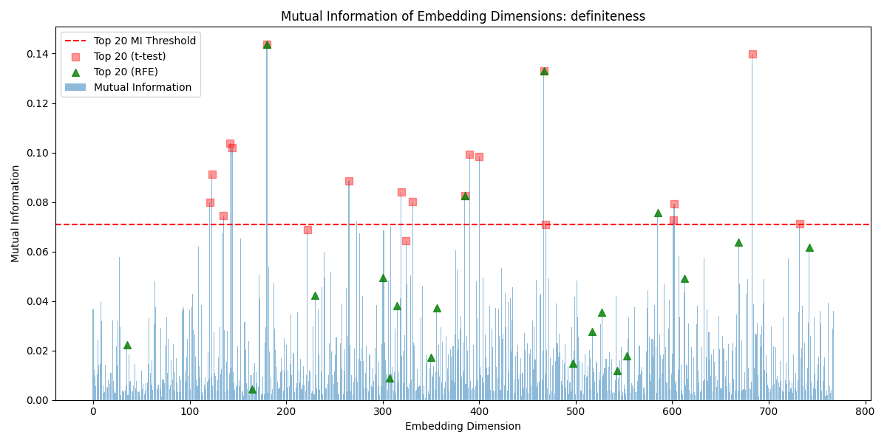
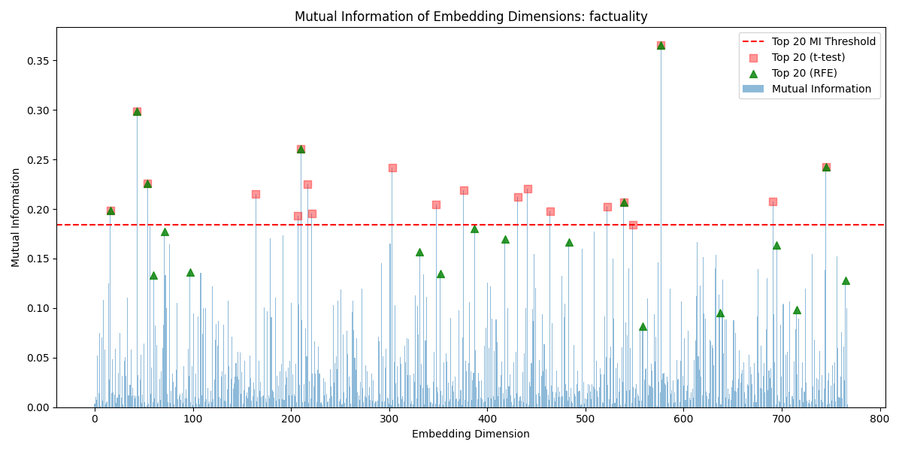
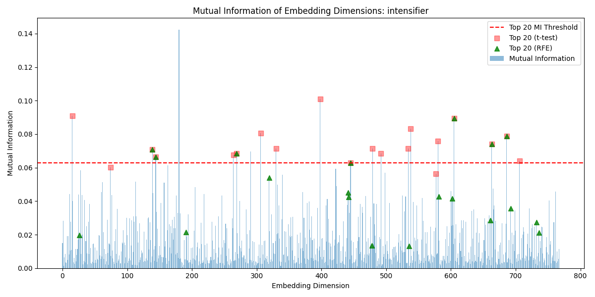
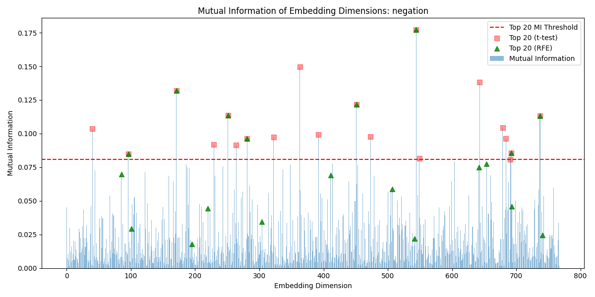
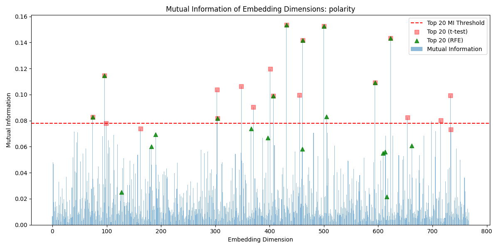
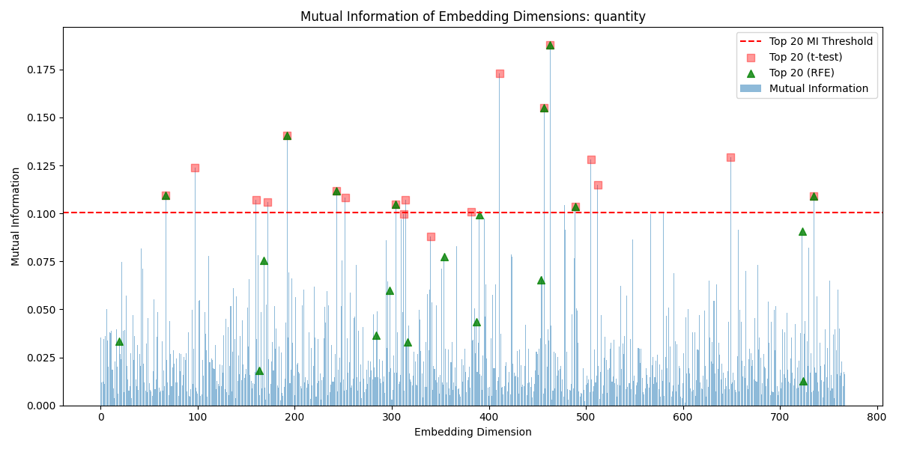
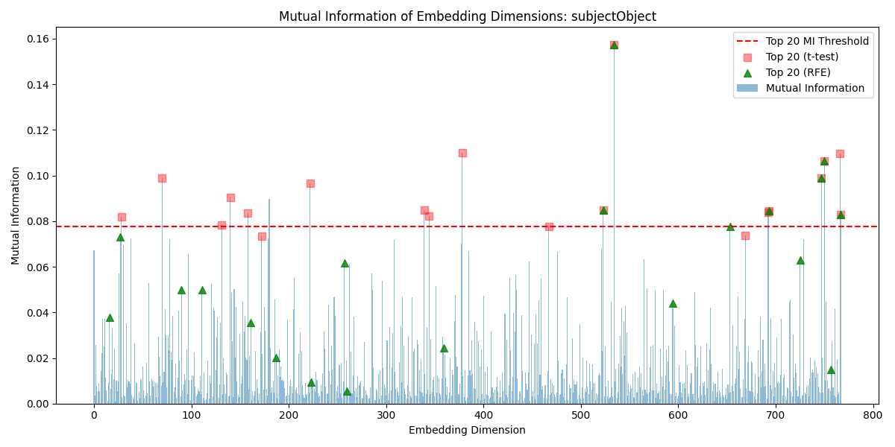
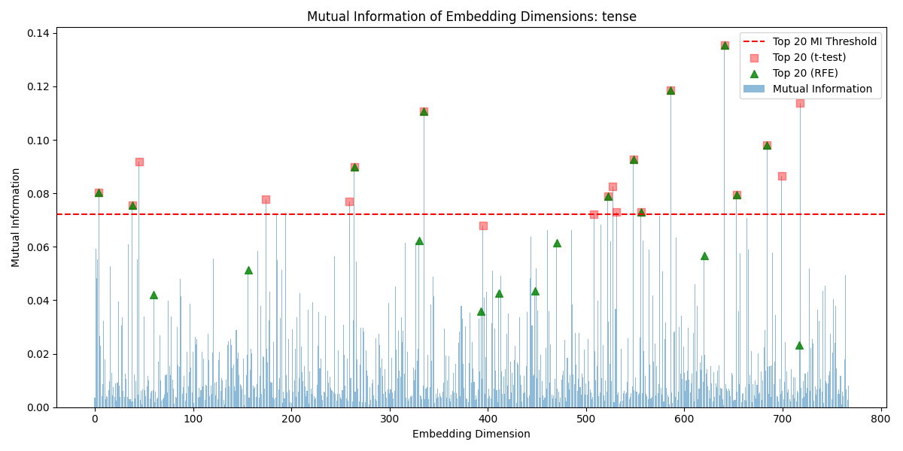
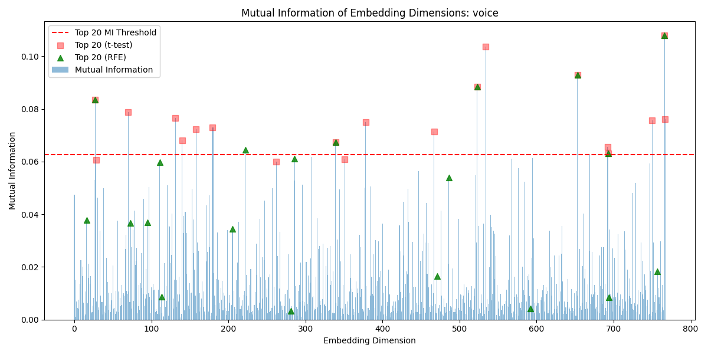

# Data for All Linguistic Properties

# Table of Contents
- [Control](#control)
- [Definiteness](#definiteness)
- [Factuality](#factuality)
- [Intensifier](#intensifier)
- [Negation](#negation)
- [Polarity](#polarity)
- [Quantity](#quantity)
- [Subject-Object](#subject-object)
- [Synonym](#synonym)
- [Tense](#tense)
- [Voice](#voice)

# Control

The control group contains sentence pairs of completely unrelated sentences. This is used to compare to the LDSPs.

_Example_
- The chef did not create a culinary delight.
- He worked incredibly long hours this week.

## Mutual Information Values with Analysis Overlays

## Top T-Test P-Values 

## Bottom T-Test P-Values 

## Top EDI Scores

| Dimension | EDI Score           |
|-----------|---------------------|
| 526       | 0.8063016256618352  |
| 760       | 0.76391532691925    |
| 515       | 0.7555881122257129  |
| 209       | 0.7231671293856037  |
| 312       | 0.7010169817598424  |
| 578       | 0.6815491652110003  |
| 235       | 0.6621993688695982  |
| 724       | 0.6500783101334103  |
| 593       | 0.6299926246059222  |
| 359       | 0.5968361605369806  |
| 186       | 0.5961458589949343  |
| 430       | 0.5677084648924078  |
| 734       | 0.5320777431477393  |
| 607       | 0.529192772275624   |
| 174       | 0.503027230540091   |
| 449       | 0.5027924284425322  |
| 125       | 0.5003061937564144  |
| 256       | 0.4894071735819835  |
| 514       | 0.4877872035117836  |
| 255       | 0.4774676135738014  |

[Back to Top](#table-of-contents)

# Definiteness

_Definiteness_ involves the use of definite or indefinite articles within a sentence, such as _the_ compared to  _a_, respectively.

_Example_
- The mountain is high
- A mountain is high

## Mutual Information Values with Analysis Overlays

## Top T-Test P-Values 

## Bottom T-Test P-Values 

## Top EDI Scores

| Dimension | EDI Score           |
|-----------|---------------------|
| 180       | 1.0                 |
| 467       | 0.9422169256193158  |
| 613       | 0.9077721893893653  |
| 742       | 0.90691740326362    |
| 356       | 0.897667972108707   |
| 35        | 0.878177426746946   |
| 385       | 0.8752264640036811  |
| 585       | 0.8700190841413323  |
| 669       | 0.8628810550056485  |
| 300       | 0.8568922143957863  |
| 230       | 0.854544538479425   |
| 527       | 0.8512075915133285  |
| 315       | 0.8493089560919207  |
| 350       | 0.8112763527756524  |
| 517       | 0.8030345894426042  |
| 683       | 0.7613975706990719  |
| 553       | 0.7538189843448626  |
| 142       | 0.7370705745528873  |
| 144       | 0.735759877310084   |
| 390       | 0.7340479734903449  |

[Back to Top](#table-of-contents)

# Factuality

_Factu involves the use of definite or indefinite articles within a sentence, such as _the_ compared to  _a_, respectively.

_Factuality_ refers to the degree of truth implied by the structure of the sentence.

_Example_
- He finished the project.
- He might have finished the project.

## Mutual Information Values with Analysis Overlays

## Top T-Test P-Values 

## Bottom T-Test P-Values 

## Top EDI Scores

| Dimension | EDI Score           |
|-----------|---------------------|
| 577       | 0.9693231140293278  |
| 43        | 0.9530179485645109  |
| 210       | 0.9513778421838679  |
| 60        | 0.9386670273507436  |
| 387       | 0.937439836425528   |
| 539       | 0.9292268534508608  |
| 745       | 0.9236147411159883  |
| 97        | 0.9150604225690285  |
| 715       | 0.9136985263867325  |
| 352       | 0.9053966521692125  |
| 16        | 0.9005991071324242  |
| 695       | 0.8979375433983333  |
| 483       | 0.8978921106012989  |
| 54        | 0.8892102979574217  |
| 558       | 0.884474931314172   |
| 71        | 0.8760285684005714  |
| 331       | 0.8709351316530085  |
| 418       | 0.8646781460540637  |
| 765       | 0.8589868748779581  |
| 637       | 0.8429591079904514  |

[Back to Top](#table-of-contents)

# Intensifier

_Intensifier_ refers to the degree of emphasis present within a sentence. 

_Example_
- The temperature is comfortable.
- The temperature is very comfortable.

## Mutual Information Values with Analysis Overlays

## Top T-Test P-Values 

## Bottom T-Test P-Values 

## Top EDI Scores

| Dimension | EDI Score           |
|-----------|---------------------|
| 686       | 0.934180427801641   |
| 441       | 0.9321526509937581  |
| 663       | 0.9294611002346882  |
| 139       | 0.9293704695167171  |
| 692       | 0.9245409401498871  |
| 269       | 0.913536979780069   |
| 605       | 0.9092588486789339  |
| 144       | 0.9020034533613148  |
| 191       | 0.8945368077687078  |
| 442       | 0.8887047242101608  |
| 445       | 0.8879712794199377  |
| 736       | 0.8854736645388658  |
| 732       | 0.8777829415906473  |
| 661       | 0.870931753648554   |
| 26        | 0.8634005134319501  |
| 602       | 0.8627352051505521  |
| 319       | 0.8582468583728078  |
| 581       | 0.852135288235209   |
| 478       | 0.7679216881336554  |
| 398       | 0.7358843589476795  |

[Back to Top](#table-of-contents)

# Negation

A _negation_ occurs when a _not_ is added to a sentence, negating the meaning.

_Example_
- The movie is interesting.
- The movie is not interesting.

## Mutual Information Values with Analysis Overlays

## Top T-Test P-Values 

## Bottom T-Test P-Values 

## Top EDI Scores

| Dimension | EDI Score           |
|-----------|---------------------|
| 544       | 0.9984163157383754  |
| 251       | 0.9651626579545954  |
| 171       | 0.9457147368522172  |
| 451       | 0.9378365428354258  |
| 281       | 0.9238864415231909  |
| 737       | 0.9199556176612027  |
| 96        | 0.9107183467920557  |
| 85        | 0.9081733038251482  |
| 642       | 0.8995368780081828  |
| 692       | 0.8968798504419594  |
| 507       | 0.8926857628644688  |
| 411       | 0.8848200959738177  |
| 654       | 0.8846203419380598  |
| 101       | 0.873304794500722   |
| 304       | 0.8683757128121086  |
| 220       | 0.8584498552734474  |
| 741       | 0.8545385371844786  |
| 693       | 0.8468608546200724  |
| 542       | 0.8104143819840479  |
| 363       | 0.7489174864133279  |

[Back to Top](#table-of-contents)

# Polarity

A _polarity_ change is similar to a negation, and occurs when an antonym is added, reversing the meaning of the sentence completely.

_Example_
- The environment is conducive.
- The environment is detrimental.

## Mutual Information Values with Analysis Overlays

## Top T-Test P-Values 

## Bottom T-Test P-Values 

## Top EDI Scores

| Dimension | EDI Score           |
|-----------|---------------------|
| 431       | 0.9937160990820624  |
| 623       | 0.9936128675740343  |
| 500       | 0.9624859379415427  |
| 505       | 0.9355931473694632  |
| 96        | 0.925030517191616   |
| 461       | 0.9162813960831465  |
| 613       | 0.9053744806716593  |
| 397       | 0.8972046800121308  |
| 594       | 0.8922485171897103  |
| 662       | 0.8880798078558046  |
| 190       | 0.8839031728466086  |
| 609       | 0.8826306181556518  |
| 74        | 0.8808142392451301  |
| 304       | 0.8789774731928346  |
| 366       | 0.8735276124636463  |
| 407       | 0.8718598564492281  |
| 127       | 0.8661563793543728  |
| 460       | 0.8496035959657419  |
| 182       | 0.8273281236890418  |
| 616       | 0.8036234999002841  |

[Back to Top](#table-of-contents)

# Quantity

A change in _quantity_, for our purposes, is defined as a switch from an exact number used to numerate the items to a grouping word.

_Example_
- There are 50 stars visible.
- There are countless stars in the sky.

## Mutual Information Values with Analysis Overlays

## Top T-Test P-Values 

## Bottom T-Test P-Values 

## Top EDI Scores

| Dimension | EDI Score           |
|-----------|---------------------|
| 390       | 0.954242945938722   |
| 457       | 0.9247097319837891  |
| 243       | 0.9230447966421638  |
| 463       | 0.919315775336876   |
| 192       | 0.8907334770863298  |
| 489       | 0.8890046875258258  |
| 735       | 0.8872494009460039  |
| 19        | 0.8816765284957104  |
| 67        | 0.8733238180217562  |
| 304       | 0.8713517447479086  |
| 168       | 0.864304859010892   |
| 723       | 0.862149304978782   |
| 298       | 0.8603889698982181  |
| 454       | 0.8520244127682207  |
| 354       | 0.8471436106053661  |
| 387       | 0.8395618120698114  |
| 284       | 0.8264161501747995  |
| 316       | 0.8206378535244789  |
| 411       | 0.7563490247374727  |
| 649       | 0.7336960154389429  |

[Back to Top](#table-of-contents)

# Subject-Object

These LDSPs contain a sentence constructed in the Subjet-Verb-Object order and a sentence constructed in the Object-Verb-Subject order, with an entity executing the verb being the subject.

_Example_
- The studio distributed the film worldwide.
- The film was distributed worldwide by the studio.

## Mutual Information Values with Analysis Overlays

## Top T-Test P-Values 

## Bottom T-Test P-Values 

## Top EDI Scores

| Dimension | EDI Score           |
|-----------|---------------------|
| 534       | 0.9486107821007524  |
| 111       | 0.9338207659784069  |
| 653       | 0.9260406793608018  |
| 523       | 0.9159906853046482  |
| 161       | 0.9145810508245302  |
| 27        | 0.8992371208162628  |
| 750       | 0.8950498318366757  |
| 359       | 0.888200307907747   |
| 187       | 0.88673337232881    |
| 257       | 0.8844058338891456  |
| 767       | 0.8829835298576147  |
| 693       | 0.8815363226127324  |
| 725       | 0.8802644739646925  |
| 594       | 0.8752531601991187  |
| 747       | 0.8724170185318775  |
| 16        | 0.8620084529085412  |
| 90        | 0.8473333187452997  |
| 757       | 0.7949175596821839  |
| 378       | 0.7347588881951416  |
| 766       | 0.7346127918107949  |

[Back to Top](#table-of-contents)

# Synonym

In these LDSPs, both sentences have the same meaning, with one word being replaced by one of its synonyms.

_Example_
- The outlook was optimistic.
- The outlook was hopeful.

## Mutual Information Values with Analysis Overlays

## Top T-Test P-Values 

## Bottom T-Test P-Values 

## Top EDI Scores

| Dimension | EDI Score           |
|-----------|---------------------|
| 203       | 0.7516031738534719  |
| 91        | 0.7513818140385038  |
| 446       | 0.6672038695550886  |
| 701       | 0.6489665059361835  |
| 654       | 0.5826933743419356  |
| 544       | 0.5800682354171006  |
| 214       | 0.5722456547794049  |
| 192       | 0.5634851781505159  |
| 676       | 0.5614545380659839  |
| 303       | 0.5596915222358976  |
| 419       | 0.5457566633745716  |
| 487       | 0.5299132638754065  |
| 36        | 0.5247905457066846  |
| 437       | 0.5230187269973138  |
| 526       | 0.5186732594179608  |
| 316       | 0.4892559414031395  |
| 605       | 0.48401115268389594 |
| 221       | 0.48183009524756254 |
| 534       | 0.477059279677542   |
| 256       | 0.47702548643877163 |

[Back to Top](#table-of-contents)

# Tense

In these LDSPs, one sentence is constructed in the present tense, while the other is in the past tense.

_Example_
- The phone rings loudly.
- The phone rang loudly.

## Mutual Information Values with Analysis Overlays

## Top T-Test P-Values 

## Bottom T-Test P-Values 

## Top EDI Scores

| Dimension | EDI Score           |
|-----------|---------------------|
| 38        | 0.9572692248488812  |
| 470       | 0.9444885809171002  |
| 586       | 0.9428359583666336  |
| 641       | 0.9297997147977743  |
| 522       | 0.9296940264215772  |
| 335       | 0.9266383442710174  |
| 684       | 0.9179191544860794  |
| 4         | 0.9168890471761524  |
| 620       | 0.912262065482804   |
| 548       | 0.9049860585630185  |
| 448       | 0.8977327948357333  |
| 653       | 0.8958563668635637  |
| 556       | 0.889681597666715   |
| 264       | 0.8833191672708458  |
| 393       | 0.8820232867826119  |
| 411       | 0.8815129978194562  |
| 156       | 0.8760219185722945  |
| 330       | 0.8575946449334019  |
| 60        | 0.8573787325640979  |
| 717       | 0.8456885891480319  |

[Back to Top](#table-of-contents)

# Voice

In these LDSPs, one sentence is written in the active voice, while the other is written in the passive voice.

_Example_
- The client promptly implemented the changes.
- The changes were promptly implemented by the client.

## Mutual Information Values with Analysis Overlays

## Top T-Test P-Values 

## Bottom T-Test P-Values 

## Top EDI Scores

| Dimension | EDI Score           |
|-----------|---------------------|
| 653       | 0.9866296544461207  |
| 523       | 0.9724414313229649  |
| 766       | 0.9263504384590185  |
| 111       | 0.9192392205411732  |
| 27        | 0.8988783280229868  |
| 286       | 0.8940936554469738  |
| 16        | 0.8766907220302863  |
| 222       | 0.8721638278175721  |
| 95        | 0.8699291114579991  |
| 693       | 0.8698394015993756  |
| 486       | 0.8413633692624615  |
| 73        | 0.8270872238147259  |
| 205       | 0.8203975064219391  |
| 339       | 0.8017267767462299  |
| 471       | 0.7659342799791763  |
| 534       | 0.760096625084844   |
| 70        | 0.7378178124818714  |
| 131       | 0.7358377759177197  |
| 767       | 0.7353889825957218  |
| 750       | 0.7349500948842033  |

[Back to Top](#table-of-contents)

