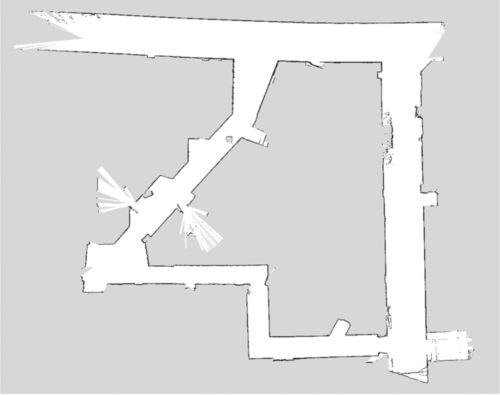

# Autonomous Racing Robot 
### Leveraging LiDAR and Computer Vision for Dynamic Path-Planning and Real-Time Obstacle Navigation in Competitive Environments

**Figure 1**: The [MIT RACECAR](https://racecar.mit.edu/) platform.

---

## Course Description

*Robotics: Science and Systems* was an intensive and practical exploration into the realm of robotics, was structured to impart a comprehensive understanding of autonomous systems design and implementation. It began with foundational principles in robotics, covering aspects such as sensor integration, control systems, and basic algorithmic approaches. As the course progressed, students delved deeper into more complex topics like real-time localization, path planning algorithms, and the integration of various sensory data. This hands-on course emphasized not only theoretical knowledge but also practical application, culminating in the creation of an autonomous racing robot. The project served as a platform for students to apply their learned skills in a challenging, real-world scenario, encouraging innovation, problem-solving, and technical proficiency in robotics. Through a series of incremental labs and assignments, students gradually built up their understanding and skills, leading to the final project that combined all elements of the course into a single, cohesive application.

***find all of our team's work <a href="https://rss2023-9.github.io/website/" target="_blank">here</a>.***

**Figure 2**: Map of the Stata Center basement, where the robot was developed.

---
## Monte Carlo Localization 

***find the full lab report <a href="https://rss2023-9.github.io/website/#lab5" target="_blank">here</a>.***

In the Monte Carlo Localization (MCL) segment of our project, we focused on enhancing the autonomous race car's ability to accurately determine its position within dynamic environments. MCL, a form of probabilistic localization, was pivotal in implementing the Simultaneous Localization and Mapping (SLAM) process, which is essential for autonomous navigation in unknown or changing spaces.

**Figure 3**: Particle cloud generated by the motion model.
 

The core of MCL involves generating a set of hypotheses (particles) about the robot's position and orientation, which are then updated as the robot moves and gathers sensory data. Our implementation utilized the onboard LiDAR sensor, which provided detailed environmental data to refine our localization estimates. This approach was particularly effective in dealing with the inherent uncertainties of real-world environments, such as dynamic obstacles and varying terrain conditions.

We iteratively refined the particle set by comparing the expected sensor readings with the actual LiDAR data, allowing us to progressively narrow down the probable location of the robot. This particle filter approach was key to achieving robust and real-time localization, enabling the robot to accurately track its position even in the presence of noise and environmental changes.

**Figure 4**: Euclidean Distance Error of Calculated Pose from Ground Truth Position Over Time

Our MCL implementation also involved optimizing various parameters such as the number of particles, resampling strategies, and motion models to balance computational efficiency with localization accuracy. The fine-tuning of these parameters was based on extensive testing in both simulated and real-world environments, ensuring that the robot could reliably determine its location under different conditions.

Moreover, the integration of MCL into our autonomous system was not just about accurate localization. It played a crucial role in the robot's decision-making processes, particularly in path planning and obstacle avoidance. By knowing its position with a high degree of certainty, the robot could make more informed choices about its movements, resulting in smoother and safer navigation.

In summary, the Monte Carlo Localization segment of our project was a testament to the effectiveness of probabilistic methods in handling the complexities of real-world autonomous navigation. It highlighted the importance of accurate localization in the broader context of robotics and served as a practical application of theoretical concepts covered in the course. This experience not only demonstrated the capabilities of MCL in a challenging environment but also provided valuable insights into the nuances of implementing such sophisticated systems in practice.

---

## Path Planning

***find the full lab report <a href="https://rss2023-9.github.io/website/#lab6" target="_blank">here</a>.***

The path planning component was a cornerstone of our project, focusing on the development and refinement of algorithms to guide the autonomous race car through complex environments. Starting with foundational algorithms like A*, we explored their basic functionalities and limitations in simulated environments. A* served as an introduction to grid-based path planning, offering a balance between efficiency and optimality. However, its performance in more dynamic and less predictable real-world settings prompted us to explore more advanced algorithms.

**Figure 5**: A single time step of the pure pursuit algorithm.

We progressed to implementing Rapidly Exploring Random Trees (RRT), a more sophisticated algorithm better suited for environments with a higher degree of uncertainty and complexity. RRT was particularly advantageous in its ability to quickly explore large spaces, making it ideal for our project's requirements. Despite its strengths, we observed areas for improvement, particularly in path optimization and efficiency.

**Figure 6**: The random forest generated by our RRT implementation while exploring the Stata Basement.

This led us to adopt RRT\*, an enhanced version of RRT, which introduces a cost function to evaluate and optimize paths. RRT\* not only maintained the exploratory strengths of RRT but also provided more optimal and smoother paths by continuously refining the tree with the best possible routes. The implementation of RRT\* marked a significant advancement in our project, enabling the autonomous race car to navigate efficiently and effectively in both simulation and real-world trials.

To further enhance the path planning capabilities, we integrated techniques like Artificial Potential Fields to improve obstacle avoidance and maneuvering in cluttered spaces. Additionally, the use of Dubins curves allowed for more natural and smooth paths, particularly beneficial for the physical constraints of the race car.

**Figure 7**: The trajectory generated by our RRT* implementation while looking for a path traversing the Stata basement.

Throughout the path planning phase, we conducted numerous tests to evaluate and fine-tune the algorithms. These tests were crucial in understanding the practical implications of each algorithm and in making iterative improvements. We optimized various parameters, including step size, search radius, and path smoothing techniques, to achieve the best balance between path quality and computational efficiency.

In conclusion, the path planning segment of our project was an extensive exploration into the world of algorithmic navigation. It highlighted the importance of selecting and fine-tuning the right algorithm for specific tasks and environments. The progression from A* to RRT and finally to RRT\* demonstrated a deepening understanding of the complexities involved in autonomous navigation. This experience not only solidified our grasp of theoretical concepts but also provided invaluable practical insights into the challenges of implementing efficient path planning in autonomous systems.

---

## Final Project: Track Racing and City Driving Challenge

***find the full briefing <a href="https://docs.google.com/presentation/d/1h5aXGOwIP4kKV5lHa6ky04JwQ3Wm1g_f2vDwT8EWEVI/edit#slide=id.p" target="_blank">here</a>.***

### Overview   
The final challenge of the course was a comprehensive test of our autonomous race car, divided into two parts: Track Racing and City Driving. This culmination required the integration of all the techniques and algorithms we had developed, including Pure Pursuit, color segmentation, and a robust state machine for navigation.

### Part A: Final Race 
For the Track Racing component, we focused on line detection using HoughLines, filtering these lines based on their distance to the center. This method proved effective, but we faced challenges when fewer than two lines were detected. In such cases, we adapted by adjusting the lookahead point based on the available line data or the previous lookahead point in the absence of lines. Our approach included minimizing the change in the steering angle to ensure smooth navigation. 

The car's speed, combined with line detection, led to varying performance. While we achieved successful runs on the Johnson Track with no lane violations at a speed of 1 m/s, higher speeds introduced challenges like oscillations and lane detection errors, such as detecting adjacent lanes.

### Part B: City Driving
The City Driving segment tested our car's ability to navigate a simulated urban environment. We implemented a line follower using color segmentation and Pure Pursuit. Additionally, Homography Transformation was utilized to determine the real-world pose of objects, enhancing our navigation capabilities.

A crucial part of this segment was our State Machine, designed to navigate the course through three main states: Driving Straight, Turning Left, and Turning Right. The system's efficiency was evident in its successful completion of the course in the least average time, particularly evident in our Start to Portal 2 trial.

### Performance Analysis
Our Monte Carlo Localization and Pure Pursuit implementations were key in both segments. They allowed us to follow loaded trajectories with high accuracy and navigate efficiently in simulation. The Lane Detection system performed with a 96% success rate, though there is room for improvement in our filtering methods.

### Takeaways and Reflections 
Reflecting on the semester, we recognized areas for future improvement. Enhancing Hough Line color segmentation, adding stop sign detection, and integrating dynamic obstacle avoidance and lane switching are some of the potential upgrades. These improvements will not only increase the car's performance but also its applicability in more complex real-world scenarios.

In conclusion, this project was a significant learning experience, challenging us to apply theoretical knowledge to practical problems and adapt to unexpected challenges. It underscored the importance of iterative development and testing in robotics and provided valuable insights into the intricacies of autonomous system design.

[*back to top*](#)