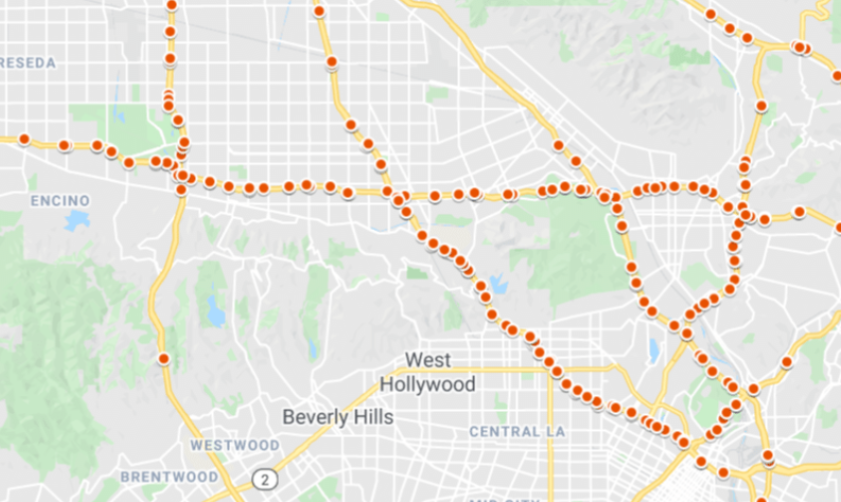
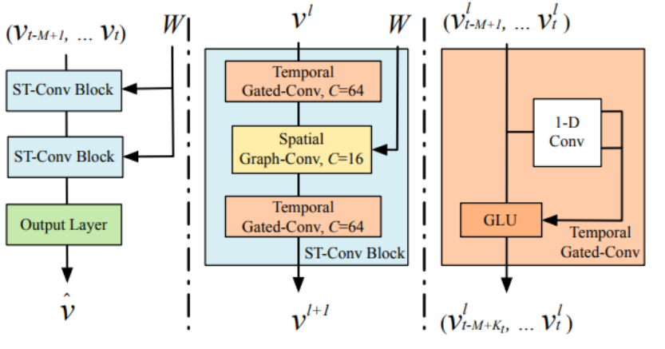
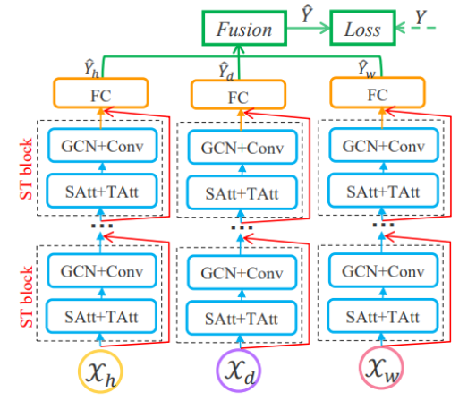
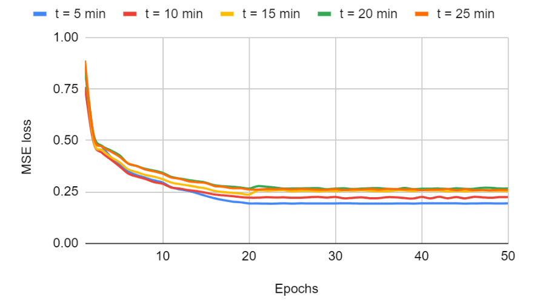
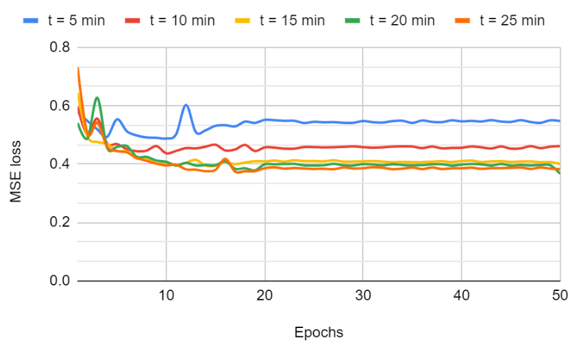
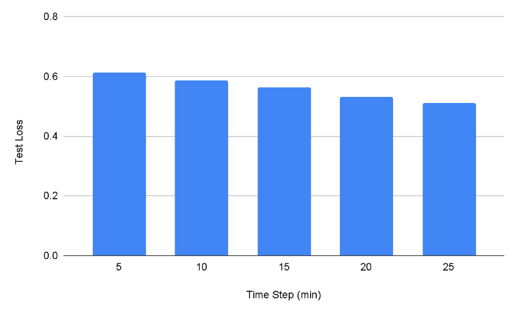
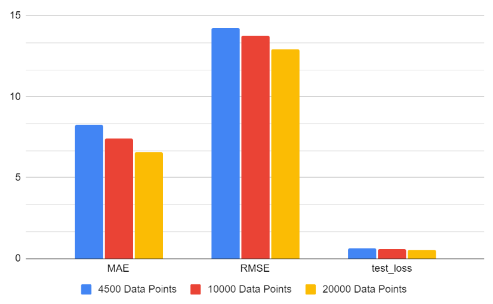
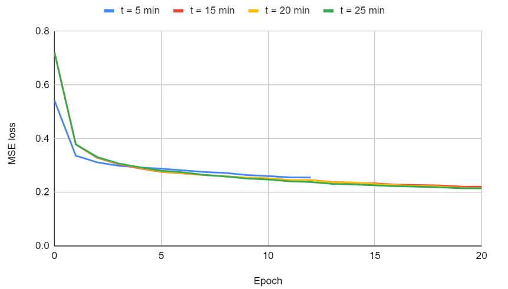
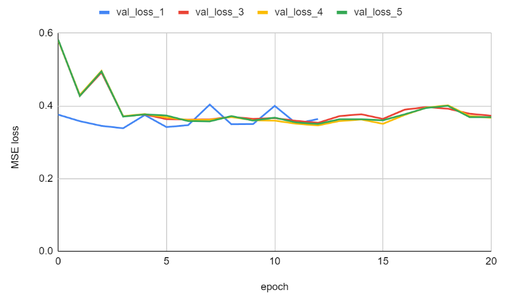
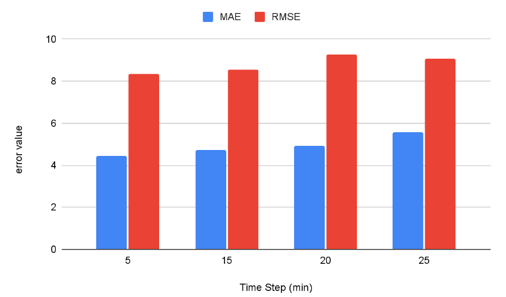

# Analyzing the Impact of Temporal Data Sparsity on Predictive Accuracy
### A Study of Spatio-Temporal Graph Convolutional Networks for Traffic Pattern Modeling

---

## Introduction and Motivations

This project seeks to answer the following question: How does the sparsity of temporal data influence the predictive accuracy of Spatio-Temporal Graph Convolutional Networks and their variants in modeling traffic patterns? The motivation for exploring the resilience of these architectures to fluctuations in temporal and spatial data is driven by the need to test for more robust and versatile AI models. Real-world applications often do not have data that aligns with what an architecture was tested. The intrinsic nature of traffic data, characterized by its non-stationarity and irregularity, poses significant challenges in forecasting. Crucially, the performance of ST-GCNs under conditions of sparse or irregular data remains an under-researched area. These architectures are an active area of research, but this gap in knowledge limits the practical deployment of these models in diverse real-world scenarios where data inconsistencies are typical. By investigating the impact of data sparsity and variability on ST-GCNs, this research aims to enhance our understanding of the model's limitations and strengths. This is not only fundamental from an AI research perspective, focusing on model robustness and adaptability, but also vital for practical applications in urban planning and traffic management, where accurate predictions are crucial for efficient decision-making and resource allocation.

---

## Related Work

### Spatio-Temporal Graph Convolutional Networks: A Deep Learning Framework for Traffic Forecasting

In 2017, Yu, Yin, and Zhu [\[7\]](#references) introduced a novel deep learning framework utilizing Spatio-Temporal Graph Convolutional Networks (ST-GCN) to address the complex challenge of traffic forecasting. Their approach marks a significant advancement in the field, leveraging the strengths of graph convolutional networks to capture spatial dependencies and temporal dynamic patterns in traffic data. They argue that traditional methods, which often rely on Euclidean data representations, fall short of accurately modeling the intricate and dynamic nature of traffic flow. The authors present ST-GCN as a model adept at handling non-Euclidean data structures.

The paper demonstrates the efficacy of ST-GCN through extensive experiments on real-world traffic datasets instead of generated test datasets. Yu, Yin, and Zhu show that their model not only captures the spatial correlations between different road segments but also effectively integrates temporal dynamics, leading to more accurate traffic predictions. The authors also compare ST-GCN with several baseline and state-of-the-art models, illustrating its superior performance in terms of prediction accuracy. This comparison is particularly relevant for studies examining the impact of data sparsity, as it highlights the model's robustness and reliability in different data scenarios. The combination of spatial and temporal data to capture multiple factors that influence a problem, such as traffic flow, helps us better predict it in the future.

### Attention Based Spatial-Temporal Graph Convolutional Networks for Traffic Flow Forecasting

Guo et al.'s 2019 proposal [\[1\]](#references) represents a significant advancement in traffic prediction using deep learning techniques. The authors address the complex traffic prediction problem with the Attention Based Spatial-Temporal Graph Convolutional Network (AST-GCN). A notable aspect of AST-GCN is its structure, which consists of three independent components, each responsible for capturing different temporal aspects of traffic flows: recent, daily-periodic, and weekly-periodic dependencies. The spatial-temporal attention mechanism is central to AST-GCN's effectiveness, which enables the model to dynamically adjust to the changing correlations in traffic data, thereby enhancing prediction accuracy. In addition, the model utilizes a combination of graph convolutions for spatial relationships and standard convolutions for temporal features, showcasing a comprehensive approach to traffic flow modeling.

The insights offered by this paper make it a valuable addition to the literature on traffic flow prediction, especially in the context of Spatio-Temporal Graph Convolutional Networks and their variants. It sets a precedent for integrating attention mechanisms in traffic prediction models, offering a novel perspective on handling complex and dynamic traffic data.

### Modeling Network-level Traffic Flow Transitions on Sparse Data

Lei et al. [\[3\]](#references) present an innovative approach to predicting traffic flow in urban environments, mainly focusing on the challenges posed by sparse data. They introduce DTIGNN, a novel graph neural network-based model that predicts network-level traffic flows from sparse observations. This model is distinctive for its integration of dynamic adjacency matrices, which consider the influence of traffic signals, and for its use of transition equations from transportation theory. A key aspect of DTIGNN is its ability to impute unobserved states iteratively, enhancing prediction accuracy.

The authors conduct comprehensive experiments using both synthetic and real-world datasets. These experiments demonstrate that DTIGNN outperforms existing state-of-the-art methods in traffic flow prediction. The paper's contribution is particularly pertinent to this research as it addresses data sparsity in traffic flow prediction. DTI-GNN's methodology offers a potential pathway for improving the predictive capabilities of Spatio-Temporal Graph Convolutional Networks in sparse data scenarios, thus filling a crucial gap in current research. This work underscores the importance of integrating dynamic network considerations and imputation techniques in modeling traffic flows under data limitations.

### Graph WaveNet for Deep Spatial-Temporal Graph Modeling

In this paper, Wu et al. [\[6\]](#references) address two significant areas for improvement in existing spatial-temporal graph modeling approaches: the assumption of fixed graph structures and the inefficiency in capturing long-range temporal sequences. The authors introduce Graph WaveNet, a novel graph neural network architecture that effectively captures hidden spatial dependencies in the data. A vital feature of this model is the self-adaptive adjacency matrix, learned through node embedding, which allows the model to uncover unseen graph structures without prior knowledge. This aspect is beneficial for cases where the explicit graph structure does not necessarily reflect the true dependency or where genuine relationships may need to be added due to incomplete connections in the data. Additionally, Graph WaveNet incorporates stacked dilated 1D convolution components, enabling it to handle very long sequences efficiently. This approach addresses the limitations of RNN-based methods, which often need help with long-range sequences due to time-consuming iterative propagation and gradient explosion/vanishing issues.

### Traffic Flow Prediction via Spatial Temporal Graph Neural Network

In this paper, Wang et al. [\[5\]](#references) propose a novel framework for predicting traffic flow using a spatial-temporal graph neural network (ST-GNN) containing Transformer layers. This approach is designed to address the challenges in analyzing and forecasting traffic conditions, which are crucial for managing and planning in smart cities. The proposed STGNN model uniquely combines several elements to capture spatial and temporal patterns in traffic data effectively. The framework uses a graph neural network layer with a position-wise attention mechanism, allowing for better aggregation of traffic flow information from adjacent roads, considering factors like road conditions, vehicle density, and emergent events. The model also integrates a recurrent network (specifically, gated recurrent units or GRUs) with a transformer layer designed to capture both local and global temporal dependencies in traffic data.

---

## Methods

### METR-LA Dataset

The METR-LA dataset is an extensively utilized resource in traffic speed prediction research. It comprises data from 207 sensors placed throughout Los Angeles County's highways. This dataset encapsulates a comprehensive four-month traffic data record from March 1st to June 30th, 2012, with sensor readings every 5 minutes. Thus, the shape of the dataset is 34272 x 207. Its wide adoption in the field is attributed to its detailed representation of traffic dynamics, making it an ideal choice for evaluating the performance of ST-GCNs under varying data sparsity and irregularity conditions.

**Figure 1**: A visualization of the sensor locations from the METR-LA dataset. [\[4\]](#references)

In order to study sparsity in temporal and spatial, the dataset was truncated for many experiments. Sensor data from regular intervals was removed in the training dataset to test temporal sparsity, while all present sensor data was used for validation and testing. Data sensors were removed from regularly spaced intersections to test spatial sparsity in data. This was completed by redefining the adjacency matrix to exclude the sensors selected to be skipped and then redefining the models with the new dimensions.

### ST-GCN Implementation

In this implementation, spatial features are extracted using graph convolution, which directly operates on graph-structured data. This method captures meaningful spatial patterns by overcoming the limitations of traditional 2-D convolutions on grids. This utilizes Chebyshev polynomials and a first-order approximation to handle the computational complexity efficiently. These approximations ensure efficient feature extraction from large-scale graphs, maintaining the integrity of spatial information. [\[7\]](#references)

Temporal features are extracted using gated CNNs, which offer advantages over recurrent networks in terms of training speed and simplicity. Temporal convolutions in STGCN are composed of 1-D causal convolutions followed by gated linear units (GLU), allowing for the capture of dynamic temporal behaviors without the limitations of recurrent architectures. This design enables parallel processing and efficient training.

The ST-Conv block is the core of the architecture, fusing both spatial and temporal features. It comprises a spatial layer sandwiched between two temporal layers, facilitating rapid spatial-state propagation and feature integration. This block applies a bottleneck strategy for feature compression and employs layer normalization to prevent overfitting. The output is a function of both spatial graph convolutions and temporal gated convolutions, ensuring a comprehensive analysis of spatio-temporal data.

**Figure 2**: The ST-GCN Architecture, with two ST-Conv blocks. [\[7\]](#references)

The STGCN architecture is delineated by its ST-Conv blocks and a fully-connected output layer. The input data is processed uniformly by these blocks to explore spatial and temporal dependencies, culminating in a comprehensive feature integration by the output layer for final prediction. The ST-Conv block was implemented and was surrounded by a temporal convolutional block containing temporal convolutional and fully connected layers, resulting in an overall 9-layer model. The convolutional channel dimensions were constant and progressed (1, 16, 32, 64, 64, 128) through the convolutional layers.

This project utilized the PyTorch framework to implement the ST-GNN within the Google Colaboratory platform; to train the ST-GNN, we employed the Mean Squared Error (MSE) loss function. In terms of optimization, the RMSprop optimizer was selected. This optimizer is adept at dealing with the vanishing and exploding gradient issues common in deep learning models, especially in complex architectures like the ST-GNN.

### AST-GCN Implementation

The AST-GCN architecture [\[1\]](#references) integrates three distinct components designed to model recent, daily-periodic, and weekly-periodic dependencies in historical data. This multi-component approach captures the complexity of temporal patterns in traffic data at different scales. This project focused on experimenting with the recent component, as we wanted to test the robustness of these models on short-term traffic flow.

A novel spatial-temporal attention mechanism is at the core of the AST-GCN model. Spatial attention is applied to capture the dynamic correlations between different locations in the spatial dimension. It uses an attention mechanism to adjust the influence among nodes adaptively based on the current traffic conditions. This allows for a much more robust spatial understanding of the transportation network. The temporal attention mechanism recognizes correlations between different time slices and adapts the importance of data in varying situations.

**Figure 3**: The AST-GCN Architecture, with various ST-Conv blocks. [\[1\]](#references)

The AST-GCN employs a spatial-temporal convolution module very similar to ST-GCN, with graph and temporal convolutional layers used to model spatial and temporal relationships. Each component of the ASTGCN contains multiple ST-Conv blocks and a fully-connected layer. The network employs a residual learning framework for optimization. The outputs of the three-time elements are merged using a parameter matrix to obtain the final prediction result. This fusion process considers each component's varying importance for different nodes based on historical data patterns.

For this project, AST-GCN was implemented with the Mean Squared Error loss function and the RMSprop optimizer, just as the ST-GNN. A total of 12 layers were used, which were divided into two blocks of temporal attention: spatial attention, an ST-Conv block, and a fully connected layer.

---

## Experiments and Results

### Temporal Data Sparsity

Robustness for sparsity in temporal data in both architectures was tested using the METR-LA dataset. Specifically, instead of receiving the entire training dataset, 4500 readings from sensors at constant time intervals were inputted. 5, 10, 15, 20, and 25-minute intervals were tested for both architectures. The ST-GCN model was trained for 50 epochs for each of the intervals, and the AST-GCN model, due to its much faster convergence and higher computation cost, was only trained for 20 epochs. Mean Average Error (MAE) and Root Mean Squared Error (RMSE) were used to evaluate the generated models by testing their prediction on each sensor reading in the succeeding 25 minutes.

For the ST-GCN, the results were quite mixed. After varying timestep, the training losses for all five intervals were relatively similar, as shown in Figure 4. The validation losses were higher, as shown in Figure 5, and the Mean Average Error decreased as the timestep increased, as shown in Figure 6. The test loss also decreased as the time step increased, as shown in Figure 7.

This indicates that sensors with readings farther apart temporally led to a more accurate model predicting future speeds. This is likely due to overfitting, with the 4500 sensor readings only 5 minutes apart, which may overfit the training data. The 4500 sensor readings 25 minutes apart offer a much more accurate picture of the traffic. The effect of the number of sensor readings is illustrated in Figure 8.

**Figure 4**: Training losses for varying time-steps for the ST-GCN architecture. 

**Figure 5**: Validation losses during training for varying time-steps for the ST-GCN architecture.

**Figure 6**: Mean average error for various time-steps for the ST-GCN architecture.

**Figure 7**: Calculated testing Mean Squared Loss for various time-steps for the ST-GCN architecture.

**Figure 8**: Calculated metrics for training the ST-GCN for 50 epochs on various training dataset lengths.

For the AST-GCN, the results were quite interesting. During training, all time steps tested had quite similar training and validation losses, as shown in Figures 9 and 10. Despite only training for at most 20 epochs, the MAE and RMSE values shown in Figure 11 were significantly lower than the ST-GCN models tested. This highlights the importance of the attention layers and how they allow for significantly more accurate predictive models to be trained.

Furthermore, despite the low number of 4500 sensors tested, the dataset with 5-minute intervals scored significantly better for predictive metrics compared to other datasets. As the interval between sensors increases, so does the error with which they are able to predict speeds. The attention layer is once again allowing a lot more spatial and temporal information to be learned from even a smaller dataset, and there is not as much overfitting compared to the ST-GCN architecture.

**Figure 9**: Training losses for varying time-steps for the AST-GCN architecture. 

**Figure 10**: Validation losses during training for varying time-steps for the AST-GCN architecture.

**Figure 11**: MAE and RMSE calculations for the AST-GCN at various timesteps.

---

## Conclusion

This project aimed to explore the impact of temporal data sparsity on the predictive accuracy of ST-GCNs and their variants. By choosing traffic modeling, the most common use of these types of architectures, I hoped to determine whether or not sparsity in data would significantly hinder their accuracy. Computation limitations were severe, which led to a drastic simplification of the original scope of experiments.

In this project, it was found that ST-GCN [\[7\]](#references) models demonstrated a counterintuitive trend where models trained with less frequent temporal data showed improved performance. As mentioned earlier, this is likely due to overfitting. To further test this, trying various timesteps with much larger datasets could help decrease this effect, allowing for the true capability of the model to be tested.

Despite this, it was found that AST-GCNs [\[1\]](#references) are relatively superior in their accuracy and their required amount of training compared to ST-GCNs. The attention layers central to this architecture help make it highly robust not only to small datasets but to temporal sparsity as well. The attention mechanism allowed more to be learned from less data.

These findings indicate that attention-based models may be significantly helpful in urban planning and traffic management settings. With the expensive costs associated with data collection and the construction of transportation systems, it is essential to know when and where the systems can be made more efficient. AST-GCNs offer an exciting solution to the traffic prediction problem by offering such high predictive accuracy for shorter training times.

The impact of spatial data sparsity and hybrid models would be great to explore for further research. Although spatial data experiments were planned, computing power limitations forced the scope of the project to be limited on the temporal side. I would also like to explore more advanced attention mechanisms alongside their applications to see where they can be applicable in increasing predictive accuracy.

---

## References

1. **Guo, S., Lin, Y., Feng, N., Song, C., & Wan, H.** (2019). Attention Based Spatial-Temporal Graph Convolutional Networks for Traffic Flow Forecasting. *Proceedings of the AAAI Conference on Artificial Intelligence*, 33(01), 922-929. [https://ojs.aaai.org/index.php/AAAI/article/view/3881](https://ojs.aaai.org/index.php/AAAI/article/view/3881). DOI: 10.1609/aaai.v33i01.3301922

2. **Jin, G., Liang, Y., Fang, Y., Shao, Z., Huang, J., Zhang, J., & Zheng, Y.** (2023). Spatio-Temporal Graph Neural Networks for Predictive Learning in Urban Computing: A Survey. *arXiv preprint arXiv:2303.14483*. [https://arxiv.org/abs/2303.14483](https://arxiv.org/abs/2303.14483)

3. **Lei, X., Mei, H., Shi, B., & Wei, H.** (2022). Modeling Network-level Traffic Flow Transitions on Sparse Data. In *Proceedings of the 28th ACM SIGKDD Conference on Knowledge Discovery and Data Mining* (KDD ’22). ACM. [http://dx.doi.org/10.1145/3534678.3539236](http://dx.doi.org/10.1145/3534678.3539236). DOI: 10.1145/3534678.3539236

4. **Lu, H., Huang, D., Song, Y., Jiang, D., Zhou, T., & Qin, J.** (2020). ST-TrafficNet: A Spatial-Temporal Deep Learning Network for Traffic Forecasting. *Electronics*. DOI: 10.3390/electronics9091474

5. **Wang, X., Ma, Y., Wang, Y., Jin, W., Wang, X., Tang, J., Jia, C., & Yu, J.** (2020). Traffic Flow Prediction via Spatial Temporal Graph Neural Network. In *Proceedings of The Web Conference 2020* (WWW '20). Association for Computing Machinery, New York, NY, USA. [https://doi.org/10.1145/3366423.3380186](https://doi.org/10.1145/3366423.3380186). DOI: 10.1145/3366423.3380186

6. **Wu, Z., Pan, S., Long, G., Jiang, J., & Zhang, C.** (2019). Graph WaveNet for Deep Spatial-Temporal Graph Modeling. *arXiv preprint arXiv:1906.00121*. [https://arxiv.org/abs/1906.00121](https://arxiv.org/abs/1906.00121)

7. **Yu, B., Yin, H., & Zhu, Z.** (2018). Spatio-Temporal Graph Convolutional Networks: A Deep Learning Framework for Traffic Forecasting. In *Proceedings of the Twenty-Seventh International Joint Conference on Artificial Intelligence* (IJCAI-2018). International Joint Conferences on Artificial Intelligence Organization. [http://dx.doi.org/10.24963/ijcai.2018/505](http://dx.doi.org/10.24963/ijcai.2018/505). DOI: 10.24963/ijcai.2018/505